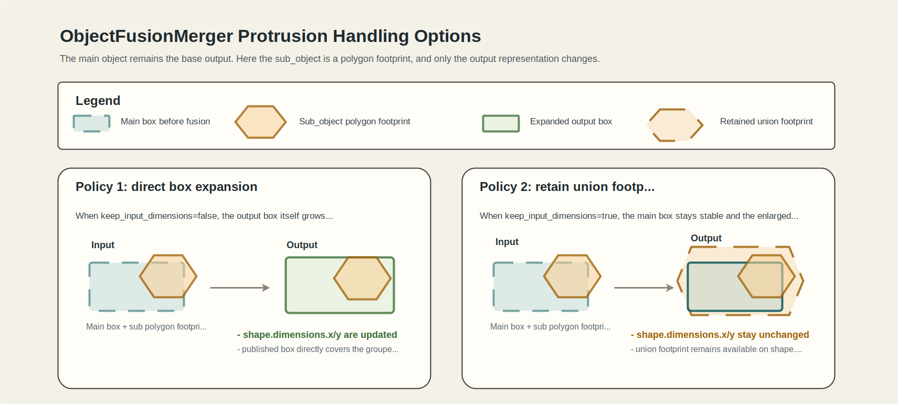
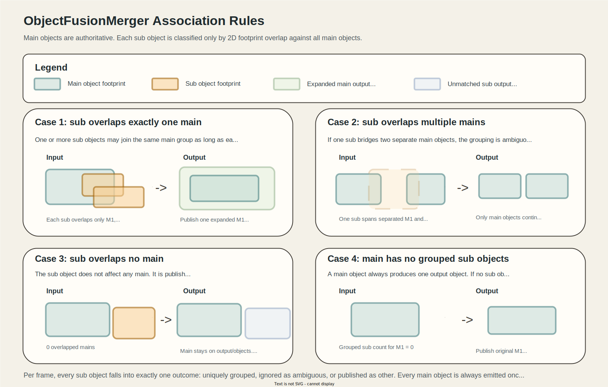

# object_fusion_merger

## Purpose

`object_fusion_merger` groups sub detected objects by footprint overlap with main detected objects and keeps the main stream as the base output.
For each main object, it can either expand the main object's non-polygon shape to enclose the grouped union or preserve the main x/y dimensions and retain the grouped union on `shape.footprint`.

The node is stateless across frames.

## Inputs / Outputs

### Input

| Name                | Type                                             | Description           |
| ------------------- | ------------------------------------------------ | --------------------- |
| `input/main_object` | `autoware_perception_msgs::msg::DetectedObjects` | Main detected objects |
| `input/sub_object`  | `autoware_perception_msgs::msg::DetectedObjects` | Sub detected objects  |

### Output

| Name                   | Type                                             | Description                                                       |
| ---------------------- | ------------------------------------------------ | ----------------------------------------------------------------- |
| `output/objects`       | `autoware_perception_msgs::msg::DetectedObjects` | Main-based detected objects after association and shape expansion |
| `output/other_objects` | `autoware_perception_msgs::msg::DetectedObjects` | Sub detected objects that did not match any main object           |

The packaged launch file remaps these by default to the following topics:

- `output/objects` -> `fusion/objects`
- `output/other_objects` -> `others/objects`

## Processing Flow

1. Synchronize the two input topics with `ApproximateTime`.
2. Transform both object lists into `base_link_frame_id`.
3. For each sub object, check whether its footprint overlaps each main object footprint.
4. If the sub object overlaps exactly one main object, add it to that main object's sub group.
5. If the sub object overlaps multiple main objects, ignore it.
6. If the sub object overlaps no main objects, publish it on `output/other_objects`.
7. For each main object, rebuild the grouped union footprint and update the output shape according to the main shape policy.
8. Publish all main objects, expanded or unchanged, on `output/objects`.

## Shape Update Rule

The output object is always based on the main object. When non-polygon dimension preservation is enabled, the grouped 2D union footprint is retained on `shape.footprint` for `BOUNDING_BOX` and `CYLINDER` outputs instead of growing their x/y dimensions.

- Orientation is kept from the main object.
- Twist is kept from the main object.
- Classification is kept from the main object.
- Existence probability is kept from the main object.

Pose and dimension handling depends on the main shape type and on `keep_input_dimensions`.

- Left: expand the output box itself so it encloses the union.
- Right: keep the box size stable and retain the union footprint in `shape.footprint`.

- `BOUNDING_BOX`: with `keep_input_dimensions=false`, x/y center is moved and x/y dimensions are expanded to tightly fit the grouped union. With `true`, x/y pose and x/y dimensions remain those of the main object and the grouped union footprint is stored in the main local frame.
- `CYLINDER`: with `keep_input_dimensions=false`, diameter expands to cover the grouped union. With `true`, x/y pose and diameter remain those of the main object and the grouped union footprint is stored in the main local frame.
- `POLYGON`: x/y pose remains the main-object pose and the footprint is rebuilt in the main local frame.
- For all shape types, the z center and height are updated to fit the full z-range of the main object and grouped sub objects.

When footprint retention is used, the retained union footprint is generated in the main object's local frame.

- `BOUNDING_BOX`: keep the main x/y dimensions for frame-to-frame stability and store the grouped union footprint in `shape.footprint`.
- `CYLINDER`: keep the main diameter for frame-to-frame stability and store the grouped union footprint in `shape.footprint`.
- `POLYGON`: rebuild the grouped union footprint in the main local frame and store it in `shape.footprint`.

The height dimension is updated so the output encloses the full z-extent of the main object and all grouped sub objects.

### Notes Per Shape Type

- `BOUNDING_BOX` main objects can either grow to the grouped union or keep their original x/y box dimensions, depending on `keep_input_dimensions`.
- `CYLINDER` main objects can either grow to the grouped union or keep their original x/y diameter, depending on `keep_input_dimensions`.
- `POLYGON` main objects keep polygon output and rebuild the footprint from the grouped union polygon in the main local frame.
- Current generic geometry utilities in Autoware ignore `shape.footprint` for non-`POLYGON` types, so retained footprints on `BOUNDING_BOX` and `CYLINDER` outputs are auxiliary metadata unless downstream components opt in to use them.

## Association Preconditions

Grouping happens only by 2D footprint overlap.

- If a sub object overlaps exactly one main object, it contributes to that main object's expanded shape.
- If a sub object overlaps multiple main objects, it is ignored and is not published.
- If a sub object overlaps no main objects, it is published via `output/other_objects`.

## Parameters

Current parameters in `config/object_fusion_merger.param.yaml` are:

- `sync_queue_size`
- `base_link_frame_id`
- `keep_input_dimensions`

## Default Behavior

With the default configuration:

- each main object always produces one output object based on the main object
- unmatched main objects remain in the output
- sub objects that overlap no main objects are emitted on `output/other_objects`
- sub objects that overlap multiple main objects are ignored
- `BOUNDING_BOX` and `CYLINDER` outputs are expanded to enclose the grouped union
- set `keep_input_dimensions=true` to keep non-polygon x/y dimensions stable and retain the grouped union in `shape.footprint`

## Test Coverage

The current focused test suite covers the following cases:

- uniquely overlapped `BOUNDING_BOX` pair expands by default
- unmatched main objects remain in the output and non-overlapping sub objects are published separately
- sub objects that overlap multiple main objects are ignored
- multiple sub objects can expand one main object together
- `BOUNDING_BOX` main object can retain a larger grouped union footprint from a sub `POLYGON` when `keep_input_dimensions=true`
- `CYLINDER` main object can retain the grouped union footprint without changing its diameter when `keep_input_dimensions=true`
- `POLYGON` main object rebuilds its footprint from the grouped union polygon

## Known Limits

- There is no temporal fusion across messages.
- The node does not maintain track IDs or track existence over time.
- When `keep_input_dimensions=true`, `BOUNDING_BOX` and `CYLINDER` outputs retain expanded footprints as metadata only. Most existing downstream components still interpret these shapes from `dimensions`, not from `shape.footprint`.
- `POLYGON` outputs keep the main object's x/y pose, so their enclosing geometry can still be conservative compared with a fully re-centered fit.
- Sub objects that bridge multiple main objects are intentionally ignored rather than split.

## Intended Usage

This node is intended for cases where the main detector should stay authoritative, while the sub detector is used either to enlarge matched non-polygon shapes or, when configured, to retain additional matched footprint extent without destabilizing the main stream's non-polygon box size.
